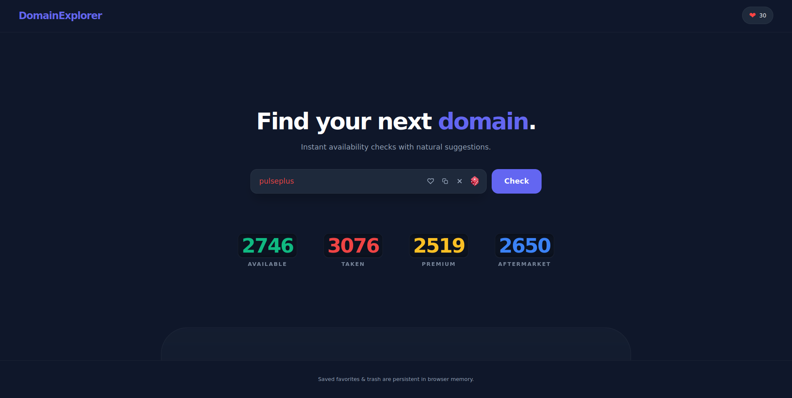
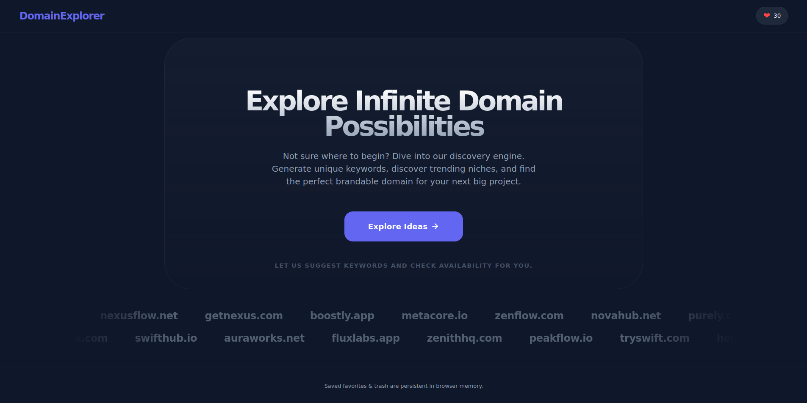
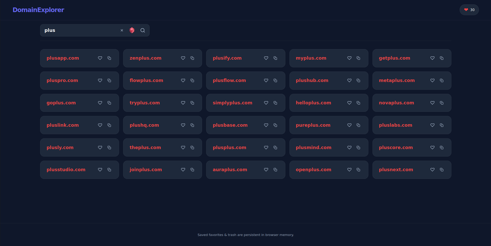
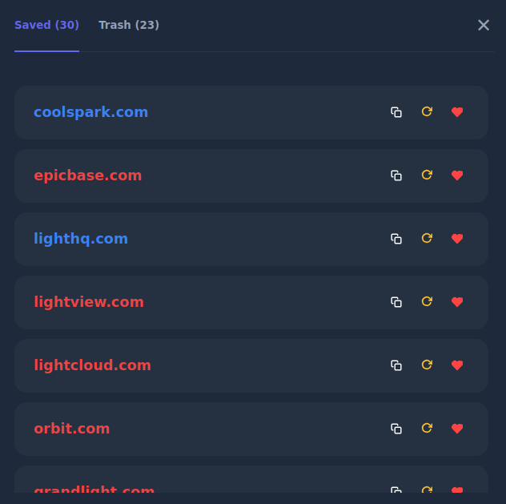

# DomainExplorer

A premium, dark-themed domain discovery tool built with React, Vite, and TypeScript. Find your next project's home with natural suggestions and real-time availability checks.






## 🚀 Features

- **Natural Suggestions:** Generates intuitive domain combinations using curated prefixes and suffixes.
- **Real-time RDAP Integration:** Direct checks against `rdap.org` for accurate availability status.
- **Robust Retry Mechanism:** Implements a 4-check fail cycle (1 initial + 3 retries) with live countdowns to handle registry rate limits.
- **Aftermarket Detection:** Deep-scans RDAP records to identify "Premium" or "For Sale" domains (marked in Blue).
- **Persistent Favorites:** Save your favorite ideas to browser `localStorage` so they're never lost.
- **Trash System:** Recently removed favorites move to a Trash tab where they can be restored or permanently deleted.
- **Manual Re-checks:** Instantly refresh the status of any saved domain with a single click.
- **Responsive Design:** Optimized for all screen sizes with a clean, centered discovery interface and a fluid results grid.
- **Premium UI:** Glassmorphism effects, smooth animations, and interactive hover states.

## 🛠️ Tech Stack

- **Framework:** React 18
- **Build Tool:** Vite
- **Language:** TypeScript
- **Styling:** Vanilla CSS (Modern Dark Theme)
- **API:** RDAP (Registration Data Access Protocol)

## 📦 Getting Started

1. **Install dependencies:**
   ```bash
   npm install
   ```

2. **Run development server:**
   ```bash
   npm run dev
   ```

3. **Build for production:**
   ```bash
   npm run build
   ```
   
